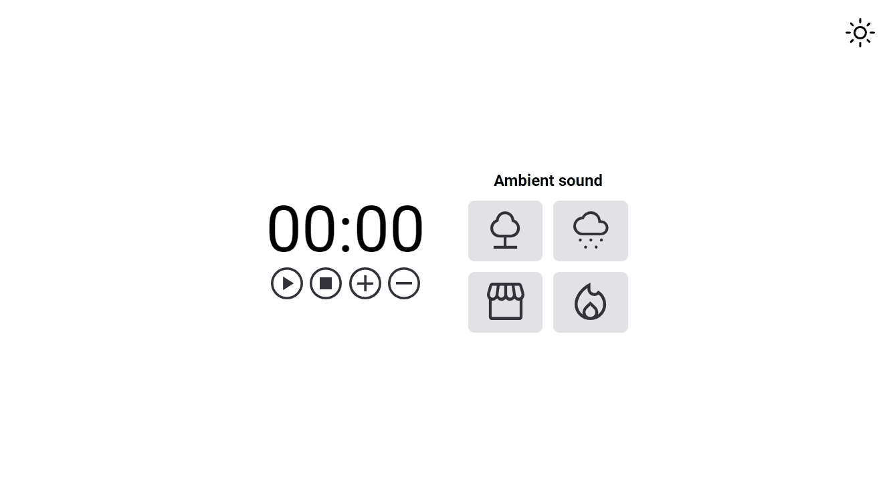

# Training Focus

## About

This is an application for use focus techniques like pomodor.

## Run

Install [Live Server extension](https://marketplace.visualstudio.com/items?itemName=ritwickdey.LiveServer) on your [Visual Studio Code](https://code.visualstudio.com/), right click on `index.html` file and then click on `Open with Live Server`.

## Contributing

This repository is using [Gitflow Workflow](https://www.atlassian.com/git/tutorials/comparing-workflows/gitflow-workflow) and [Conventional Commits](https://www.conventionalcommits.org/en/v1.0.0/), so if you want to contribute:

- create a branch from develop branch;
- make your contributions;
- open a [Pull Request](https://docs.github.com/en/pull-requests/collaborating-with-pull-requests/proposing-changes-to-your-work-with-pull-requests/creating-a-pull-request) to develop branch;
- wait for discussion and future approval;

I thank you in advance for any contribution.

## Status

Finished

## License

[MIT](./LICENSE)
