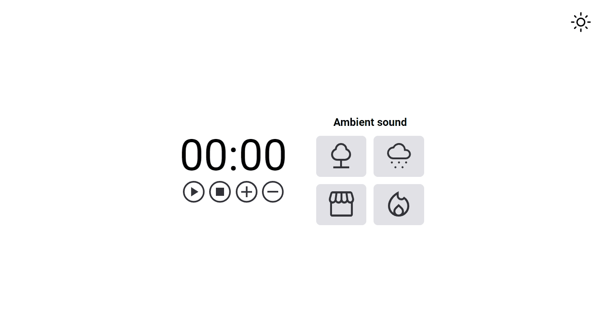

# Training Focus

## About

A timer with ambient sounds for helping with focus. Has dark and light themes, and can act like a Pomodoro Timer.

## Run

Install [Live Server extension](https://marketplace.visualstudio.com/items?itemName=ritwickdey.LiveServer), right click on `index.html` file and then click on `Open with Live Server`.

## Status

Done ✅

## License

[MIT](./LICENSE)
