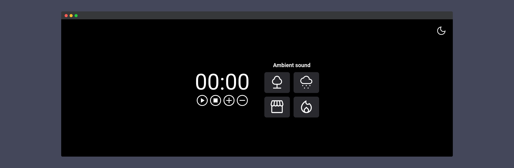

# Training Focus


## Resources

- [HTML](https://developer.mozilla.org/pt-BR/docs/Web/HTML)
- [CSS](https://developer.mozilla.org/pt-BR/docs/Web/CSS)
- [JavaScript](https://developer.mozilla.org/pt-BR/docs/Web/JavaScript)
- [Node.js](https://nodejs.org/)
- [lite-server](https://github.com/johnpapa/lite-server)

## Content language

- English

## About

A timer with ambient sounds for helping with focus and dark and light themes, can act like a Pomodoro Timer.



## Run

First install all dependencies:

```
npm install
```

Then run with:

```
npm run start
```

## Contributing

- Fork this repository;
- Clone to your machine;
- Create a branch like:
  - `feature/description`
  - `bugfix/description`
- Commit your code;
- Submit a pull request and wait until is reviewed;

## Status

Done ✅

## License

[MIT](./LICENSE)
